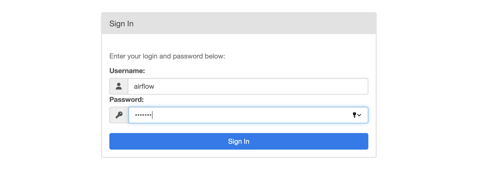
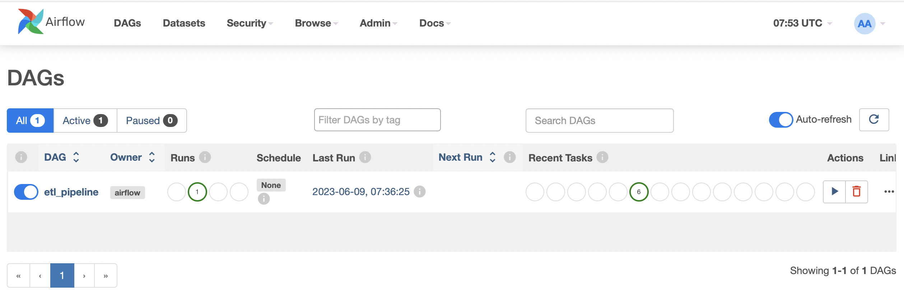

# Backend Engineering Take-Home Challenge

## Services Introduction 
- **Database services:** postgres, etl-pipeline-db, redis
- **Airflow services:** 
  - airflow-webserver, airflow-scheduler, airflow-worker
  - airflow-triggerer, airflow-init, airflow-cli, flower
- **API services:** etl-pipeline-api

**Important Ports**
- airflow-webserver: 8080
- etl-pipeline-api: 5000

## Getting Started
To build and run the application, follow these steps:
- Clone the repository
- Manage the Docker images defined in the docker-compose.yml file

```bash
# build Docker images defined in docker-compose.yml file. 
docker-compose build
# start and run the services defined in docker-compose.yml file
docker-compose up
#stop and remove the containers, networks, and volumes created by docker-compose.yml file.
docker-compose down
```

Access the Airflow UI by opening the URL `http://127.0.0.1:8080` in web browser. 
Login with the following credentials:
- username: airflow
- password: airflow



Once logged in, we can see the Airflow UI homepage:



## API introduction

The API introduction includes multiple endpoints, all of which use HTTP GET requests and do not require any parameters. 
It startswith `http://127.0.0.1:5000`. Here are the details of each endpoint:


| API     | DESC                                        | Response                                                                                                                                                                      |
|---------|---------------------------------------------|-------------------------------------------------------------------------------------------------------------------------------------------------------------------------------|
| /trigger-etl  | trigger dags                                | - 200  Message: "ETL process started"<br/> - 400 Message: "Trigger the API frequently, please try again later."<br/> - 400 Message: "Dag is loading, please try again later." |
| /check/table  | check table whether created                 | - 200 Message: "Table created"<br/>- 500 Message: "Table creation failed"                                                                                                     |
| /check/feature_derivation | check whether feature_derivation inserted   | - 200  Message: "Feature Derivation inserted"<br/>- 500  Message:"Feature Derivation insert failed"                                                                                                                       |


## Test

To test the application, there are two options:
### Option 1: Running Unit Tests
Go to the `test` directory in project.
Run the unit test code `test/test_table_details.py`

### Option 2: Accessing API Endpoints using CURL
```bash
curl http://127.0.0.1:5000/trigger-etl
curl http://127.0.0.1:5000/check/table
curl http://127.0.0.1:5000/check/feature_derivation
```


## Others
### Feature Derivation
From the provided CSV files, derive the following features, deatils in `dags/tasks/feature_derivation.py`:
- Calculate the number of experiments each user participated in.
- Calculate the total run time of experiments for each user.
- Calculate the number of days since each user signed up.

### Deliverables
Please provide the following in a GITHUB REPOSITORY.
1. A Dockerfile that sets up the environment for your application. 
`Dockerfile` and `docker-compose.yaml`
2. A requirements.txt file with all the Python dependencies. 
`requirements.txt`
3. A Python script that sets up the API and the ETL process. 
`run.sh` 
4. A brief README explaining how to build and run your application, and how to trigger the ETL process.
`README-build.md`

